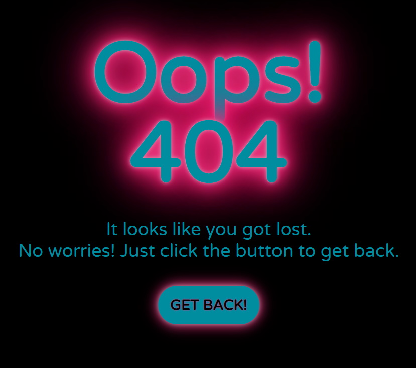

Milestone Project 2
======
## **Bounce Ball | A Classic Online Ball Game** ##

By: [Marina Christen](mailto:puksbusinessworld@gmail.com), May 2021<br>
This webpage is the second of four Milestone Projects which is a part of the Full Stack Web Development Program of [Code Institute](https://www.codeinstitute.net/).

Screenshot
======

All screenshots created using [Am I responsive](http://ami.responsivedesign.is/).


Live Project
======
[View the live project here]( https://puksrevolution.github.io/milestone-project-2/)

---
# Table of contents

+ [Project](#project)
  * [Project description](#project-description)  
  * [Website description](#website-description)

+ [User Experience Design](#user-experience-design)
  * [Project Goals](#project-goals)
  * [User Stories](#user-stories)    

+ [Design](#design)
  * [Colours](#colours)
  * [Typography](#typography)    
  * [Imagery](#imagery)  
  * [Wireframes](#wireframes)

+ [Features](#features)
  * [Responsive Design](#responsive-design)
  * [Interactive Elements](#interactive-elements)
  * [Future Features](#future-features)

+ [Technologies](#technologies)
  * [Languages](#languages)
  * [Tools](#tools)

+ [JavaScript](#javascript)     
  * [JavaScript Documentation](#javascript-documentation)  

+ [Testing](#testing)     
  * [Known Bugs](#known-bugs)      

+ [Deployment](#deployment)
  * [Resporitory on GitHub](#resporitory-on-github)
  * [Workspace on GitPot](#workspace-on-gitpot)
  * [Back to GitHub](#back-to-github)
  * [Deploy the projet to GitHub Pages](#deploy-the-projet-to-github-pages)
  * [How to run the project locally](#how-to-run-the-project-locally)
    - [Forking the GitHub Repository](#forking-the-gitHub-repository)
    - [Cloning the GitHub Repository](#cloning-the-gitHub-repository)

+ [Credits](#credits)
  * [Code](#code)
  * [Media](#media)
  * [Content](#content)  
  * [Acknowledgements](#acknowledgements)  
  

<small><i><a href='http://ecotrust-canada.github.io/markdown-toc/'>Table of contents generated with markdown-toc</a></i></small>

---

Project
======
### **Project description** ###
The purpos of this project is to showcase the knowledge of HTML, CSS & JavaScript I gained
so far in this course. The task is to  build an interactive front-end site. 
The site should respond to the users' actions, allowing users to actively engage with data, alter the way the site
displays the information to achieve their preferred goals.

### **Website description** ###
This webpage provides the users with an entertaining simple ball game.
It is easy to understand and simple to interact with feedback for the times, 
when you need to wait for something....
It also trains a person's reaction time, dexterity and endurance.
The layout of the game is an Hommage to the classic arcade games.

[Back to contents](#contents)

User Experience Design
======
### **Project Goals** ###

- To build something awesome to be proud of.
- To make effective use of course knowledge.
- To make a project that works and is practical.
- To create a fun game that makes the user want to stay and play again.

### **User Stories** ###

- As a user, I want to easily understand the main purpose of the site clear and easily understand instructions on how to play the game.
  - Solution:<br>
  The website has two pages, the index.html and the game.html. 
  The large clear titel and the instruction how to play the game on the index page, 
  will enable the users to immediately see what the site and game is about as soon as they enter.   

- As a user, I want to view the website, the layout and content clearly on any device.
  - Solution:<br>
  The website is made responsive on all devices with a simple layout, css classes, 
  a container and media queries.  

- As a user, I want to be able to start a game when I am ready.
  - Solution:<br>
  A button to start the game added below the instruction content with a href to the game page.

- As a user, I want be able to start a new game when the current game has ended. 
  - Solution:<br>
  A Modal appears when the user loos the game and there is a button below the "Game Over" message to start the game again with a href to the game page, so that the site get automaticly reloaded.

- As a user, I want to be able to quit the game and get back to the index page with the instruction.
  - Solution:<br>
  A Modal appears when the user loos the game and there is a button below the "Game Over" message to quit the game with a href to the index page.  

- As a user, I want to see a clear top and bottom border of the gamefield.
  - Solution:<br>
  The div of the gamefield has a solid border of 0.3rem and a shiny neon style color that stands out 
  very well against the black background. 

- As a user, I want to see my score.
  - Solution:<br>
  A Modal appears when the user loos the game and it will show up a messag why the user loos and it shows the reached score of the user. 

[Back to contents](#contents)

Design
======

### **Colours** ###
The colore theme and I have choosen, is an Hommage to the classic arcade games. 
The black backgroung in combination with the rich pink and the dark blue 
gives the whole layout this shiny neon effect of the arcade game times.


​
- *Black* (#000000) - Black
- *Paradise Pink* (#FF0263) - Rich Pink
- *Blue Munsell* (#008DA0) - Dark Blue
- *Sky Blue Crayola* (#00C5DF) - Bright Blue
- *White* (#FFFFFF) - White
- *Ao English* (#008000) - Dark Green
- *Yellow Green Color Wheel* (#04B304) - Bright Green 
- *Lava* (#C50021) - Dark Red
- *Rose Madder* (#E71135) - Bright Red

The recognisable classic green and red color for the game buttons helps the user
better to identify the purpos of them.

### **Typography** ###
The used Font family is Varela Round and by default Sans-Serif.

### **Imagery** ###
<br>
A simple and good recognisable Favicon, created with [paint.net](https://www.getpaint.net/roadmap.html) in the good old arcade games styles, shines in the browser window next to the webpage title.

### **Wireframes** ###


[Back to contents](#contents)

Features
======

### **Responsive Design** ###
​
Responsive design on all devices with using css style code to give a simple, user friendly display.
​
### **Interactive Elements**​ ###

- The **main features** of the site are:
  - A home page with a instruction how to play the game and a game start button to navigate to the game page and start the game.
  - An interactive game with a styled div as a ball on a gamefield rendered with a clear border.
  - The div/ball and position is createt with a JavaScript function.
  - The movement and speed of the div/ball is createt with a JavaScript function.
  - Before the game beginns is there a visual count down form 3 till 0 and the word Start
  - The div/ball move function has set a time out of 1500 miliseconds, so that the user get a breath moment to react to the falling ball.
  - The game is based around the arcade game Theme.
  - A user score counter represented by a message on a appearing modal at the end of the game.
  - A appearing modal with a game over message, when the user loos the game.
  - At the bottom of the appearing modal is a new game and a quit game button for navigate purpos.
  - The start game button refreshes the game.html to start a new game.
  - The quit game button with a href for the index.html brings the user back to the home page.
 
- **Additional Site features:**
  - A friendly HTTP 404 Error landing page for site visitors to see if a requested page is unavailable or cannot be accessed.
    - The page provides a button to click to return the visitor to the homepage.
​
      
​
​
### **Future Features**​ ###

- This small app has the potential to be expanded with **additional features**:  
  - A Leaderboard in classic arcade game style with a list of the top 10 people highscore, which played the game. 
    - The user get at the end the score and gets the possibility to add their name to the leaderboard.
  - Different levels with more speed, two or three balls at the same time, a ball which will move randomly in all directions etc.


[Back to contents](#contents)

Technologies
======

### **Languages** ###

- [HTML5](https://developer.mozilla.org/en-US/docs/Web/HTML)
  - Used as the main markup language for the website content.
- [CSS3](https://developer.mozilla.org/en-US/docs/Web/CSS)
  - Used to style the individual webpages.
- [JavaScript](https://developer.mozilla.org/en-US/docs/Web/JavaScript)
  - Used to create the interactive functionality of the website

### **Tools** ###

- [Git](https://git-scm.com/)
  - Git was used for version control by utilizing the Gitpod terminal to commit to Git and push to GitHub.
- [GitHub](https://github.com/)
  - Used to store, host and deploy the project files and source code after being pushed from Git.
- [GitPod](https://www.gitpod.io/)
  - An online IDE linked to the GitHub repository used for the majority of the code development.
- [Coolors](https://coolors.co/)
  - An online tool used to choose the website colour scheme.
- [What is my Screen Resolution](http://whatismyscreenresolution.net/)
  - An online tool to find out the screen resolution on your device used for CSS @media queries
- [Am I Responsive?](http://ami.responsivedesign.is/)
  - A tool for taking a quick snapshot of the responsive breakpoints of the website to visualize how the site will look on different device screen sizes in one place. The resulting screenshot is also used as the README.md logo image.
- [paint.net](https://www.getpaint.net/download.html)
  - A photo and images editor program.  ​

[Back to contents](#contents)

JavaScript
======

### **JavaScript Documentation** ###

JavaScript documentation with  screenshots can be found in a separate [JavaScript.md](JavaScript.md).

[Back to contents](#contents)

Testing
======

Testing information can be found in a separate [testing.md](testing.md).

### **Known Bugs** ###

All information of bug and bugs fix can be found in a separate [testing.md](testing.md).

[Back to contents](#contents)

Deployment
======
The website was develoyed using Gitpod and using Git pushed to GitHub, 
which hosts the repository.
I made the following steps to To create this project:

### **Resporitory on GitHub** ###
- I opened up GitHub in the browser.
- I signed in with my username and password.
- I selected "Your repositories".
- I selected and used the code-institute-full-temlate repository I got from the [Code Institute](https://www.codeinstitute.net/) 
to created a public milestone-project-2 repository with the button "use this Template".

### **Workspace on GitPod** ###
- I used the green "Gitpod" button to open the milestone-project-2 repository in the workspace Gitpod.
- I pinned first the workspace milestone-project-2 on the dashbord.
- Then I opened the workspace and created the required folders, files and code for the website and added all needed images.
- I used regular the git commands to add, commit and push the work on Gitpod to GitHub.

### **Back to GitHub** ###
- I saved the work I did on Gitpod at the end of every day with the help of the git push command, 
which pushes (saves) everything back on GitHub.

### **Deploy the project to GitHub Pages** ###
- I located at the top of the Repository the "Settings" Button on the menu.
- I had to scroll down the Settings page untilthe "GitHub Pages" Section.
- I clicked the dropdonwn called "None" under "Source" and select "Master Branch".
- I clicked on the "Save" button and the page automatically refreshed.
- I had to scroll down again to the "GitHub Pages" Section to get the published site link for my project.

### **How to run the project locally** ###
You can either fork or clone the GitHub repository to use this project.

- ### **Forking the GitHub Repository** ###
  - Log in to GitHub and locate the GitHub account [Puksrevolution](https://github.com/Puksrevolution)
to get the milestone-project-2 repository mentioned above.
  - Make a copy of the GitHub Repository by "forking" the orginal repository onto your own account, 
where changes can be made without affecting original repository.
  - Click on the fork icon (located on top right of the page at the same level of repository name)
  - You should now have a copy of this repository into your GitHub account.

For more information on how to clone a repository, please check this [GitHub documentation](https://docs.github.com/en/github/getting-started-with-github/fork-a-repo).

- ### **Cloning the GitHub Repository** ###
  - Log in to GitHub and locate the GitHub account [Puksrevolution](https://github.com/Puksrevolution) 
  to get the milestone-project-2 repository mentioned above.  
  
  - Under the repository name, click the **Code** button.
  - **Copy** the url in the dropdown box.
  - Using your favourite **IDE** open up your preferred terminal.
  - **Navigate** to your desired file location.
​​
```
gh repo clone Puksrevolution/milestone-project-2
```
    
You can find all the steps to follow according your chosen method in this [GitHub documentation](https://docs.github.com/en/github/creating-cloning-and-archiving-repositories/cloning-a-repository) on how to clone a reposistory.

[Back to contents](#contents)

Credits
======

The JavaScript ball game was created by following a tutorial from [Jannis Seemann](https://www.udemy.com/courses/search/?src=ukw&q=Jannis+Seemann) 
on Udemy with the tutors permission to use the code for other Projects.
- Cours: Modernes JavaScript (ES6): jQuery, node.js, und viel Praxis!
  - Abschnitt 8 Objecte
    - [59.Projekt Objekte: Spiel entwickeln](assets/credit/59.Projekt-Objekte_Spiel-entwickeln)<br>

This was then modified to fit the game design: 
- Setting a time out function 
- Adding a modified modal with a score function and two individual messages
- layout desinge change to get the arcade game style
- added a home page and a error 404 page to it

Used a css sniped from [Free Frontend](https://freefrontend.com/css-glow-text-effects/)
- [Mark Heggan](https://markheggan.co.uk)
  - [CSS NEON / Simple animated neon effect created with CSS.](https://codepen.io/markheggan/pen/LjrVYN) 

````
text-shadow:
    0 0 6px rgba(202,228,225,0.92),
    0 0 30px rgba(202,228,225,0.34),
    0 0 12px rgba(30,132,242,0.52),
    0 0 21px rgba(30,132,242,0.92),
    0 0 34px rgba(30,132,242,0.78),
    0 0 54px rgba(30,132,242,0.92);
````

### **Content** ###
- All content was written by the developer.

### **Media** ####
- All images are from the developer and were edited by the developer.

### **Acknowledgements** ###
- Jannis Seemann for the re-use of many ideas and code snippets.
- Simon Vardy, Praveen and Michael Standen for their support and help.
- Code Institute Course material.

[Back to contents](#contents)