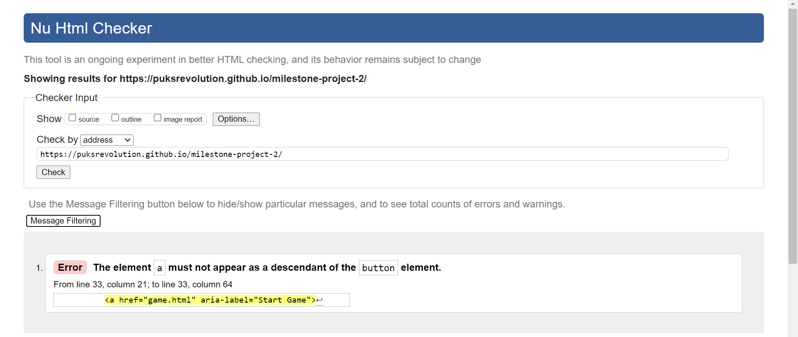
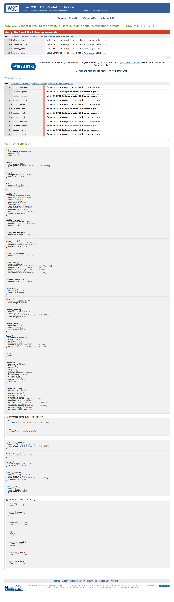
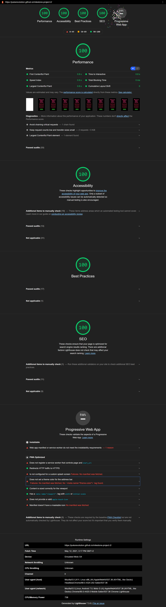
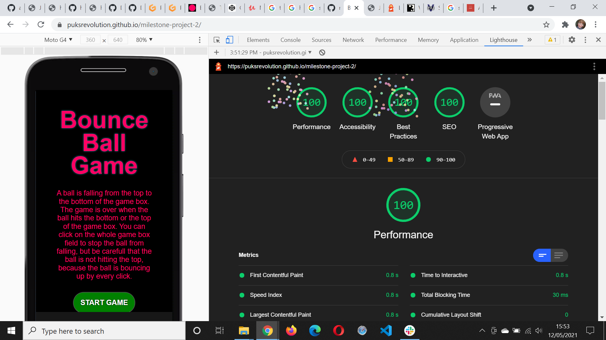
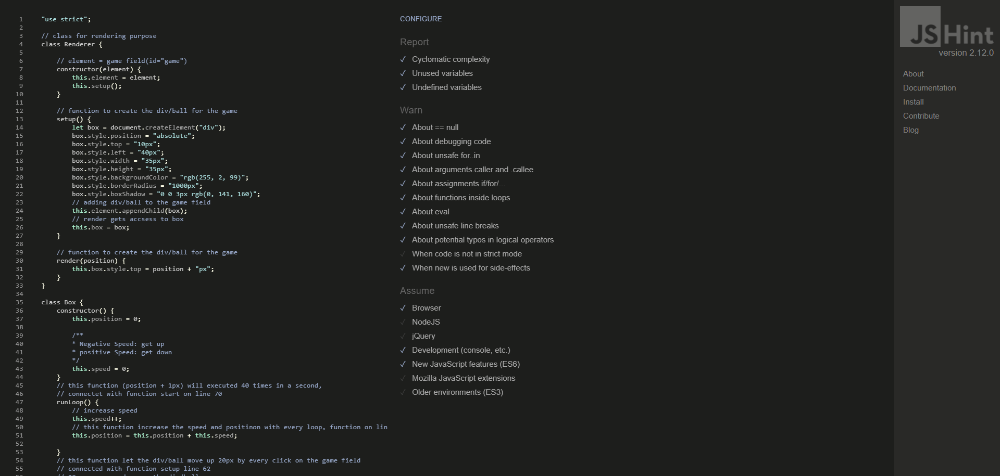
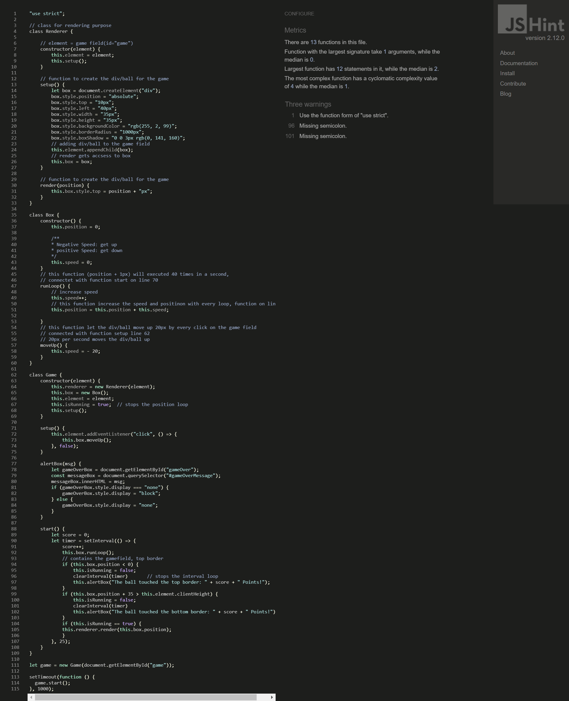
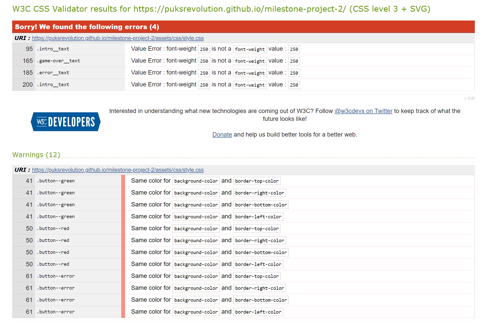
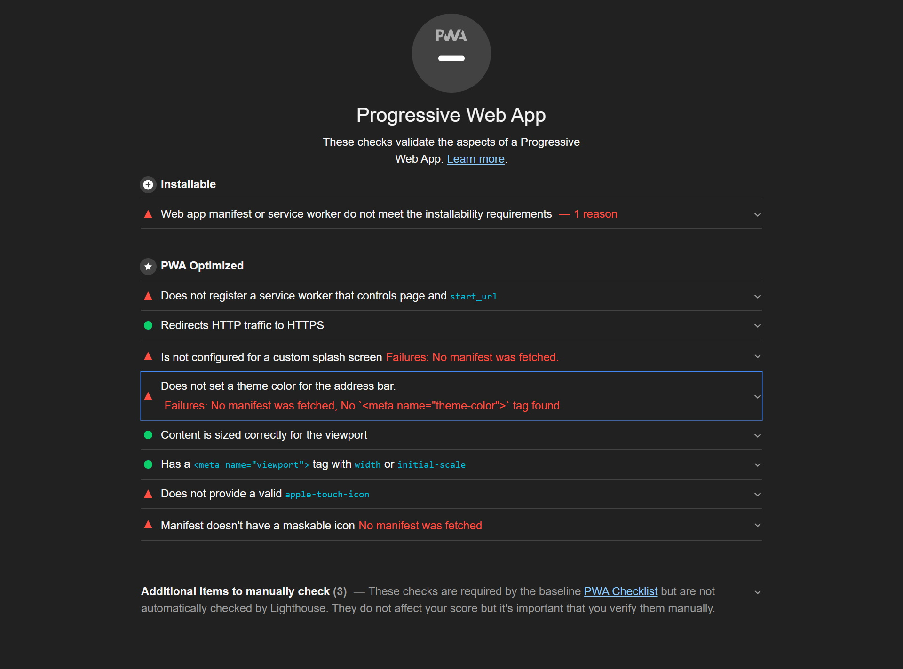
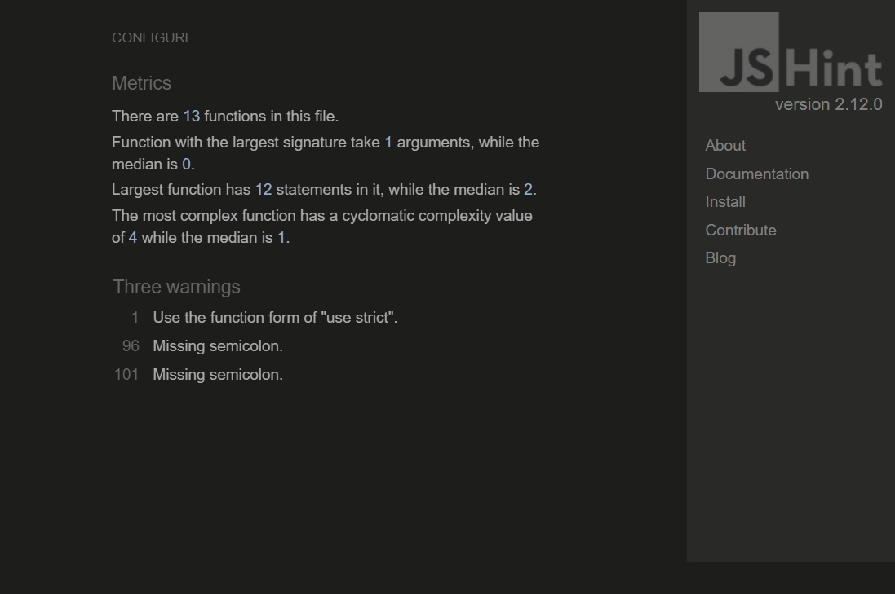

Milestone Project 2
======

## **Testing Details** ##

[Main README.md file](https://github.com/Puksrevolution/milestone-project-2/blob/master/README.md)

[View the live project here.](https://puksrevolution.github.io/milestone-project-2/)

---

# Table of contents

- [Automated Testing](#automated-testing)
  - [Validation Services](#validation-services)
- [Manual Testing](#manual-testing)
  - [Testing the responsivity of different screen sizes](#testing-the-responsivity-of-different-screen-sizes)
  - [Browser testing undertaken on Laptop](#browser-testing-undertaken-on-laptop)
  - [Testing undertaken on smartphone device](#testing-undertaken-on-smartphone-device)
- [Bugs](#bugs)
    - [Bugs](#bugs)
    - [Bug fix](#bug-fix)
    
---

Automated Testing
======

## **Validation Services** ##

The following **validation services** and **linters** were used to check the validity of the website code.

- [W3C Markup Validation](https://validator.w3.org/) 
  - This validator checks the markup validity of Web documents in HTML, XHTML, SMIL, MathML, etc.

  

- [W3C CSS validation](https://jigsaw.w3.org/css-validator/)
  - This validator checks the validity of cascading style sheets (css) and (X)HTML documents with style sheets.

  

- [Chrome DevTools Lighthouse](https://developers.google.com/web/tools/lighthouse)
  - An open-source automated tool for improving webpages by running audits for performance, accessibility, progressive web apps, SEO etc.

  - ### **Desktop Performance Report** ###

    

  - ### **Mobile Performance Report** ###

    

- [JSLint](https://jslint.com/)
  - JSLint is a code quality tool that detects errors and potential problems in JavaScript code.
  - The following option were selected to prevent  errors and warning being returned owing to the strict nature of the checking:
  

  - game.js testing using JSLint passed the linter test successfully with the following selected options: 
    - Assume: a browser
      - This was required as JSLint is intolerant of DOM HTML `.getElementByID()` method.
    - Tolerate: single quote strings
       - This was needed to handle the font awesome bell icon `bellIconDiv.innerHTML = '<i class="far fa-bell-slash"></i>';` string.
    - Tolerate: this
      - Used in game.js function `alarmSetButton.onclick`
    - Tolerate: Whitespace mess
      - JSLint is very picky about whitespace at the end of comments as well as code. The .js files were cleansed of whitespaces but the odd one still lurks here or there giving frustrating errors. It's also very sensitive to indentation styles. 
        - The code is indented with the standard 2 spaces but triggers JSLint warnings
        
    - /\*global\*/ directive is used to instruct JSLint not to give undeclared 'Image' warnings when creating new HTMLImageElement instances.
    

    - **game.js results**
    

- [JSHint (version 2.12.0)](https://jshint.com/)
  - JSHint is a community-driven tool that detects errors and potential problems in JavaScript code.
  - The following option were selected to prevent  errors and warning being returned owing to the strict nature of the checking:

    

  - **game.js results**

    
 

Manual Testing
======

### **Testing the responsivity of different screen sizes** ###

- Hardware:
    - ThinkPad E14 Gen Laptop 
    - 14,0" FHD (1920 × 1080) TN antireflex, 220 cd/m²    
- Tested Operating Systems:
   - Windows 10 Pro 64
- Tool:
    - [What is my Screen Resolution](http://whatismyscreenresolution.net/)
      - An online tool to find out the screen resolution on your device used for CSS @media queries   
   
| Device | Screen size | Pass/Fail |
| :---: | --- | :---: |
| Desktop | 17" |  |
| Pad | 13" |  |
| Smartphone | 7" |  |
|  | 5" |  |
|  | 4" |  |

### **Browser testing on Laptop** ###
- Hardware:
    - ThinkPad E14 Gen Laptop 
    - 14,0" FHD (1920 × 1080) TN antireflex, 220 cd/m²    
- Tested Operating Systems:
    - Windows 10 Pro 64

​
| Browser | Version | Pass/Fail |
| :---: | --- | :---: |
| Chrome | 90.0.4430.212 |  |
| Firefox | 87.0 |  |
| Edge | 90.0.818.56 |  |
| Opera | 76.0.4017.107 |  |
| Safari | 5.1.7 |  |

### **Testing undertaken on smartphone device** ###

- Hardware:
    - Galaxy A20e 5.80"
- Tested Operating Systems:    
    - Android 10

| Browser | Version | Pass/Fail |
| :---: | --- | :---: |
| Samsung |13.2.1.70 |  |
| Chrome | 81.0.4044.138 |  |
| Firefox | 88.1.3 |  |

Bugs
======

## **Bugs** ##

- [W3C Markup Validation](https://validator.w3.org/) 
  
  

- [W3C CSS validation](https://jigsaw.w3.org/css-bugs/)
  
  

- [Chrome DevTools Lighthouse](https://developers.google.com/web/tools/lighthouse)   

    

- [JSHint (version 2.12.0)](https://jshint.com/)   

        

## **Bug fix** ##

- [W3C Markup Validation](https://validator.w3.org/)

  - Removed the button tag and gave the a tag the css style classes of the button and the type button.

- [W3C CSS validation](https://jigsaw.w3.org/css-bugs/)

  - Removed the font-weight: 250; from the intro_text, game-over_text and error_text css classes.
  - Replaced all h3 tags with p tags on the index, game and 404 html files.
  - The same background-color and border-color of the buttons is wanted like this.

- [Chrome DevTools Lighthouse](https://developers.google.com/web/tools/lighthouse)
  - The PWA will get optimized, when the developer knows how to do that.

- [JSHint (version 2.12.0)](https://jshint.com/)
  - Fixed the missing semicolon on line 96 and 101.

[Back to contents](#contents)